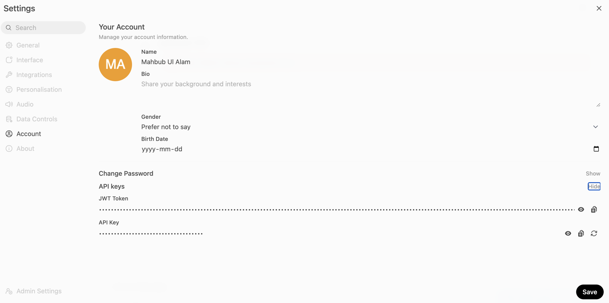
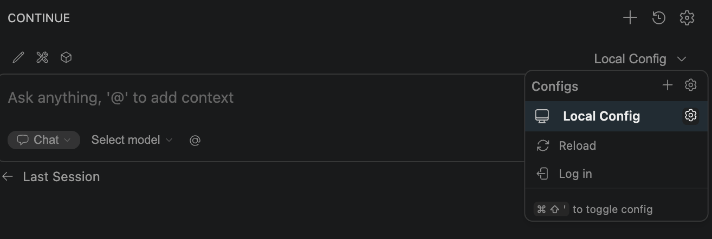
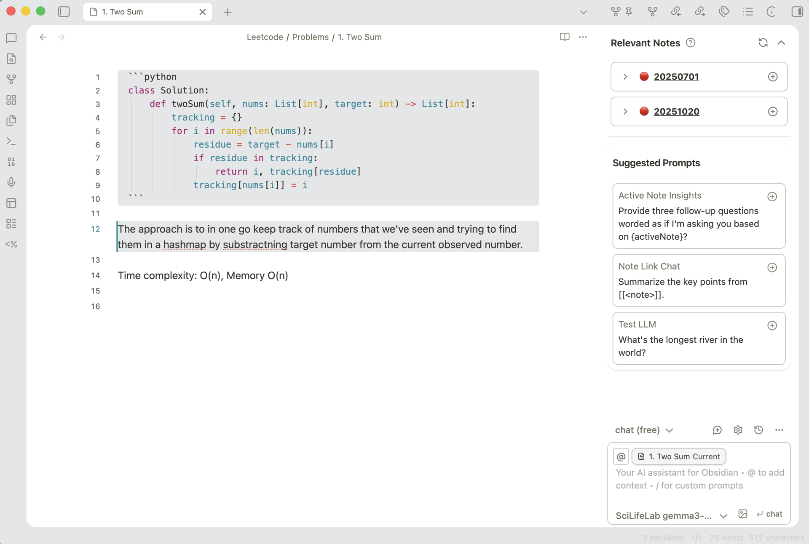
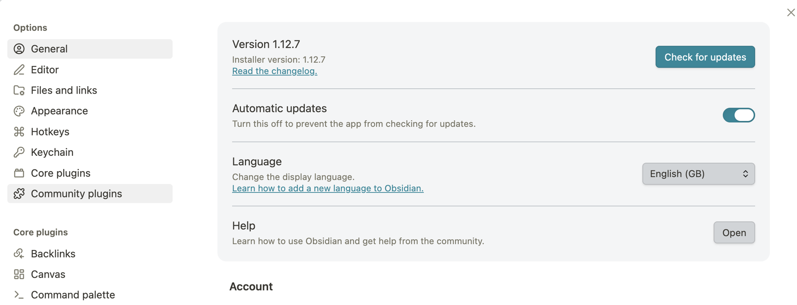
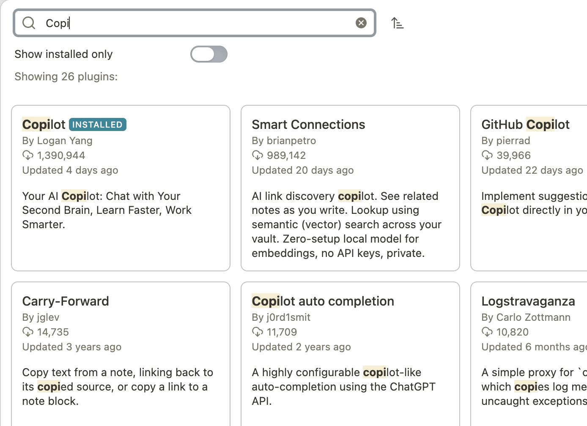
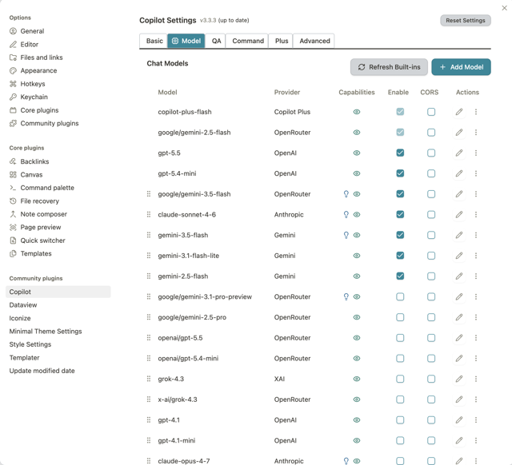
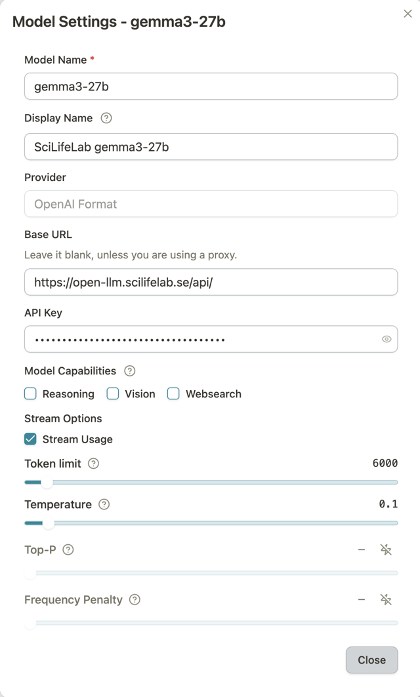
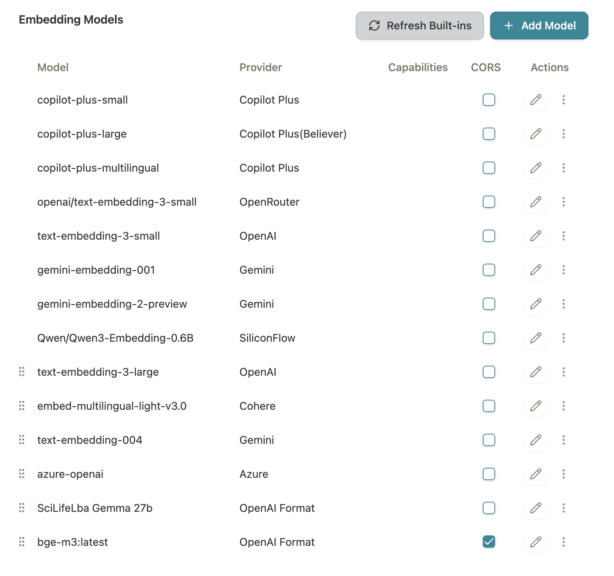
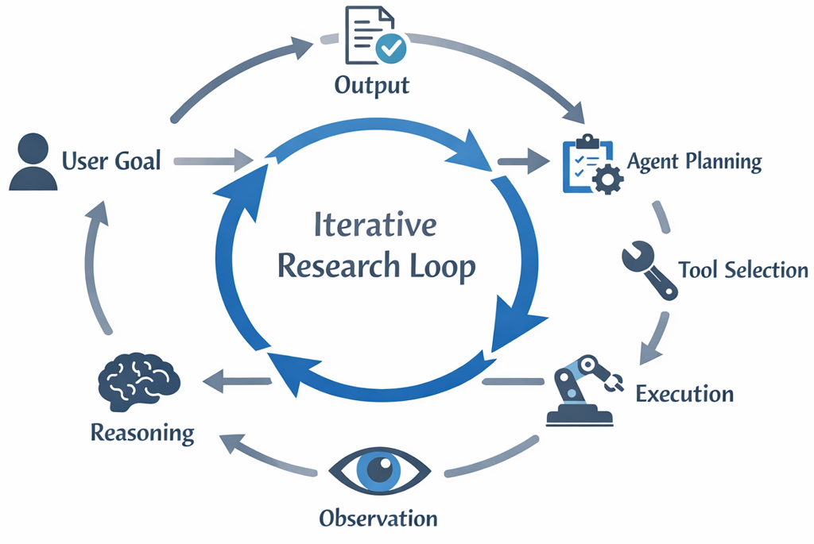

# OpenLLM pilot: Getting started with the API

**For:** Pilot users of the SciLifeLab-hosted LLM service
**Service URL:** [https://open-llm.scilifelab.se](https://open-llm.scilifelab.se)
**Contact:** [serve@scilifelab.se](mailto:serve@scilifelab.se)

## What this service is

This pilot provides API access to open-weight LLMs hosted on infrastructure controlled by SciLifeLab.

!!! info "What is an API?"
    API stands for Application Programming Interface. It is a set of rules and protocols that allows different software applications to communicate to each other and exchange data or services.

The primary goal is enabling you to embed LLMs in your research workflows, automation pipelines, and tools via the API.

A chat interface is available as a convenience, but the pilot is not optimized for a ChatGPT-style experience.

For the full use policy, see the [OpenLLM pilot use policy](/use-policy/) document.

Your prompts and outputs stay on SciLifeLab-controlled infrastructure in Sweden. We do not train models on your data.

## Get your API key



1. Log in to [https://open-llm.scilifelab.se](https://open-llm.scilifelab.se)
2. Go to **Settings → Account → API Keys**
3. Click **Create new API key**
4. Copy and save the key securely. It starts with `sk-`

!!! note
    If you do not see the option to create an API key, ask the pilot team ([serve@scilifelab.se](mailto:serve@scilifelab.se)) to add you to the Pilot Users group.

    Your API key expires after 4 weeks. Regenerate it when it stops working.

## Connect to popular tools

Since the API is OpenAI-compatible, many tools support it out of the box. You just change the base URL and API key.

### VS Code (Continue extension)

Based on this guide: [Connect Visual Studio Code to Open WebUI for vibe coding](https://henrynavarro.org/connect-vs-code-to-open-webui-for-vibe-coding-e6f74f1148ec)

Continue is an open-source AI code assistant extension for VS Code. To connect it to our service:

1. Install the Continue extension from the VS Code marketplace.
2. Open Continue config.



3. Update the config file:

```yaml
name: Local Assistant
version: 1.0.0
schema: v1
models:
  - name: gemma3-27b
    provider: openai
    model: gemma3-27b
    apiBase: https://open-llm.scilifelab.se/api
    apiKey: sk-YOUR-TOKEN
    template: none
    defaultCompletionOptions:
      contextLength: 128000
      maxTokens: 8192
    roles:
      - chat
      - edit
      - apply
      - autocomplete
# More models could be added this way
context:
  - provider: code
  - provider: docs
  - provider: diff
  - provider: terminal
  - provider: problems
  - provider: folder
  - provider: codebase
```

### Obsidian (note taking app)

Obsidian is a free Markdown note-taking app that has a wide selection of plugins. One of them allows you to use LLMs directly in the app with your notes.



You can ask questions about a note or a combination of notes, edit them using an LLM, and build an index of related notes in your knowledge base.

**Setup**

1. Open **Settings**.
2. Open **Community plugins**.

   

3. **Browse**.
4. Find the **Copilot** plugin and install it.

   

5. **Enable** it.
6. Open **Options**.
7. In the **Models** tab click **Add chat model**.

   

8. Fill out the form:

    - **Model name:** `gemma3-27b`
    - **Provider:** OpenAI Format
    - **Base URL:** `https://open-llm.scilifelab.se/api`
    - **API key:** `sk-*` — take it from Open WebUI
    - **Tick** CORS

   

9. If you want to build an index of your notes you need to add an embedding model:

    - **Model name:** `bge-m3:latest`
    - **Provider:** OpenAI Format
    - **Base URL:** `https://open-llm.scilifelab.se/api`
    - **API key:** `sk-*` — take it from Open WebUI
    - **Tick** CORS

   

You can read more about the plugin in the official user guide *Documentation*.

### Other agents and IDEs

We've been exploring a few options so far, including PyCharm, Cursor, and the agents they offer. They haven't quite clicked for our setup yet, so we're continuing to look at alternatives.

If you are successful running other agentic tools with this API token, please let us know.

### LangChain

```python
from langchain_openai import ChatOpenAI

llm = ChatOpenAI(
    base_url="https://openllm.scilifelab.se/api",
    api_key="<change-it-to-sk-your-api-key>",
    model="gemma3:latest",
)
response = llm.invoke("What is CRISPR-Cas9?")
print(response.content)
```

### LlamaIndex

```python
from llama_index.llms.openai_like import OpenAILike

llm = OpenAILike(
    api_base="https://openllm.scilifelab.se/api",
    api_key="<change-it-to-sk-your-api-key>",
    model="gemma3:latest",
    is_chat_model=True,
)
response = llm.complete("What is CRISPR-Cas9?")
print(response)
```

### Any OpenAI-compatible client

The general pattern is always the same. Find the setting for:

- **Base URL / API base:** set to `https://openllm.scilifelab.se/api`
- **API key:** `<change-it-to-sk-your-api-key>`
- **Model name:** `<your-chosen-model-name>`

## Make your first API call

The service exposes an OpenAI-compatible API. This means any tool, library, or script that works with the OpenAI API also works with our service. You only need to change two things: the base URL and the API key.

### Using curl

`curl` is a command-line tool that sends HTTP requests. It comes pre-installed on macOS and Linux. On Windows, it is available in PowerShell. This is the quickest way to test that your API key works before writing any Python code.

Check which models are available:

```bash
curl https://openllm.scilifelab.se/api/models \
  -H "Authorization: Bearer <change-it-to-sk-your-api-key>"
```

Use the model name from this response in the `model` field of your requests.

```bash
curl https://openllm.scilifelab.se/api/chat/completions \
  -H "Authorization: Bearer <change-it-to-sk-your-api-key>" \
  -H "Content-Type: application/json" \
  -d '{
    "model": "gemma3:latest",
    "messages": [{"role": "user", "content": "What is mass spectrometry?"}],
    "max_tokens": 300
  }'
```

### Using Python (OpenAI client library)

Install the library:

```bash
pip install openai
```

Make a request:

```python
from openai import OpenAI

client = OpenAI(
    base_url="https://openllm.scilifelab.se/api",
    api_key="<change-it-to-sk-your-api-key>",
)
response = client.chat.completions.create(
    model="gemma3:latest",
    messages=[
        {"role": "user", "content": "What is mass spectrometry?"}
    ],
    max_tokens=300,
)
print(response.choices[0].message.content)
```

### Using Python (raw requests)

```python
import requests

response = requests.post(
    "https://openllm.scilifelab.se/api/chat/completions",
    headers={
        "Authorization": "Bearer <change-it-to-sk-your-api-key>",
        "Content-Type": "application/json",
    },
    json={
        "model": "gemma3:latest",
        "messages": [{"role": "user", "content": "What is mass spectrometry?"}],
        "max_tokens": 300,
    },
)
print(response.json()["choices"][0]["message"]["content"])
```

## Use it in your workflow

Below are some starting points for common research workflows. These are pointers, not full tutorials. The idea is to show you how little code it takes to plug our LLM into things you are already doing.

### Summarize a batch of abstracts

```python
from openai import OpenAI

client = OpenAI(
    base_url="https://openllm.scilifelab.se/api",
    api_key="<change-it-to-sk-your-api-key>",
)
abstracts = [
    "Abstract text 1...",
    "Abstract text 2...",
    "Abstract text 3...",
]
for i, abstract in enumerate(abstracts):
    response = client.chat.completions.create(
        model="gemma3:latest",
        messages=[
            {
                "role": "system",
                "content": "You are a research assistant. Summarize the following abstract in 2-3 sentences.",
            },
            {"role": "user", "content": abstract},
        ],
        max_tokens=200,
    )
    print(f"--- Abstract {i+1} ---")
    print(response.choices[0].message.content)
```

### Extract structured data from text

```python
import json
from openai import OpenAI

client = OpenAI(
    base_url="https://openllm.scilifelab.se/api",
    api_key="<change-it-to-sk-your-api-key>",
)
text = """
The patient cohort consisted of 142 individuals aged 45-72.
Treatment with 50mg metformin twice daily showed a 23% reduction
in fasting glucose levels over 12 weeks.
"""
response = client.chat.completions.create(
    model="gemma3:latest",
    messages=[
        {
            "role": "system",
            "content": (
                "Extract structured information from the text. "
                "Return valid JSON only with keys: "
                "cohort_size, age_range, drug, dosage, outcome, duration."
            ),
        },
        {"role": "user", "content": text},
    ],
    max_tokens=300,
)
result = json.loads(response.choices[0].message.content)
print(json.dumps(result, indent=2))
```

### Classify items in a loop

```python
from openai import OpenAI

client = OpenAI(
    base_url="https://openllm.scilifelab.se/api",
    api_key="<change-it-to-sk-your-api-key>",
)
genes = ["BRCA1", "TP53", "ACTB", "GAPDH", "EGFR"]
for gene in genes:
    response = client.chat.completions.create(
        model="gemma3:latest",
        messages=[
            {
                "role": "user",
                "content": (
                    f"Is {gene} primarily an oncogene, tumor suppressor, "
                    f"or housekeeping gene? Answer in one word."
                ),
            }
        ],
        max_tokens=10,
    )
    print(f"{gene}: {response.choices[0].message.content.strip()}")
```

## Ideas: what researchers can use LLM APIs for



These are practical starting points, not exhaustive. The common thread is that an LLM accessed via API can handle repetitive tasks that would otherwise take hours of manual work. None of these require building a full application. A short Python script calling the API is often enough.

- **Literature triage and screening.** Feed a batch of abstracts to the API and ask it to classify each by relevance to your research question, extract key methods, or flag papers that mention a specific gene, compound, or technique. Useful when screening hundreds of PubMed search results for a systematic review.
- **Structured data extraction from unstructured text.** Clinical notes, lab reports, supplementary materials, and protocol documents all contain structured information buried in free text. The API can extract drug names, dosages, cell lines, organism names, or experimental conditions into JSON or CSV format for downstream analysis.
- **Drug and gene annotation assistance.** Given a list of gene names or compound identifiers, the API can generate draft functional annotations, summarize known interactions, or classify genes by pathway involvement. For example, loop through a list of differentially expressed genes and ask the model to summarize each gene's known role and disease associations. The output is a starting point for curation, not a replacement for database lookup.
- **Protocol and methods drafting.** Given a set of parameters (organism, assay type, reagents, equipment), the API can draft a first version of a methods section or standard operating procedure. The output still needs expert review, but it saves time on the boilerplate.
- **Translation and reformatting across formats.** Convert code between languages (R to Python), reformat data descriptions for repository submissions (e.g. GEO, ArrayExpress metadata), or translate abstracts for multilingual dissemination.

These examples are the simplest form of LLM integration: one script, one API call per item, no tool use. For more advanced use cases where the LLM calls external tools (PubMed, UniProt, ChEMBL), orchestrates multi-step reasoning, or acts autonomously — what the field calls AI agents — see the [Going further: AI agents and automation](#going-further-ai-agents-and-automation) section below.

## Tips for getting good results

- **Be specific in your prompts.** Clear, structured instructions produce better output. Instead of "analyze this data", try "extract the drug name, dosage, and outcome from the following clinical text and return the result as JSON."
- **Use system prompts.** The system message in the `messages` array sets the model's behavior. Use it to constrain the output format and give the model a role.
- **Keep context focused.** If you are processing long documents, break them into chunks and process each separately. This produces more coherent results.
- **Set `max_tokens` appropriately.** If you only need a one-word classification, set `max_tokens=10`. This speeds up responses and reduces irrelevant output.
- **Temperature 0 for deterministic tasks.** For extraction, classification, or anything where you want reproducible results, set `"temperature": 0` in your request.

## Going further: AI agents and automation

If you are interested in building more advanced workflows where LLMs call tools, query databases, or orchestrate multi-step research pipelines, here are resources from our team.

### Workshop materials (hands-on code)

**Developing AI Agents in Life Sciences** (March 2026 workshop). Hands-on sessions on building AI agents with LangGraph/ReAct and the Model Context Protocol (MCP). Repository: [https://github.com/ScilifelabDataCentre/scilifelab-ai-agent-mcp-workshop-2026-03-05](https://github.com/ScilifelabDataCentre/scilifelab-ai-agent-mcp-workshop-2026-03-05)

The repo has two self-contained sessions you can work through on your own:

- `Section_1_LangGraph/` — build drug discovery AI agents using LangGraph and the ReAct pattern
- `session-2-mcp/` — expose tools over MCP and connect agents across servers

Both run in Docker containers with no local Python setup required.

### Recorded talks

**Current state of AI Agents in life sciences** (February 2026 webinar). A one-hour introduction to what AI agents are, their potential in life sciences, and an overview of recent agent platforms. Watch: [https://www.youtube.com/watch?v=aOtLszUsMjw](https://www.youtube.com/watch?v=aOtLszUsMjw)

### Event series

The SciLifeLab Data Centre runs a recurring event series called *Tools for AI/ML research in life sciences* with workshops and webinars on practical topics including AI agents, model deployment, Docker packaging, and GPU computing. Browse past and upcoming events: [https://www.scilifelab.se/data-ai/tools-event-series/](https://www.scilifelab.se/data-ai/tools-event-series/)

## Troubleshooting

- **"Unauthorized" or 401 error:** Your API key is invalid or expired. Regenerate it in Open WebUI (**Settings → Account → API Keys**).
- **"Model not found" error:** The model name in your request doesn't match what's available. Check `/api/models` for the exact name.
- **Slow responses:** This is a pilot on shared infrastructure, not a production service. Response times will vary depending on load. If latency matters for your workflow, try reducing `max_tokens` or breaking requests into smaller chunks.
- **Connection timeout:** The service may be temporarily down for maintenance or model changes. Try again in a few minutes. If it persists, email [serve@scilifelab.se](mailto:serve@scilifelab.se).

Need help getting started? Email [serve@scilifelab.se](mailto:serve@scilifelab.se) or reach out on the AI network Slack channel.

## Important reminders

!!! warning
    - This is a pilot service, not production. No guaranteed uptime, latency, or model availability.
    - Models and configurations may change during the pilot.
    - Do not process patient data or data classified as sensitive.
    - Your feedback is the most valuable output of this pilot. Share it at [serve@scilifelab.se](mailto:serve@scilifelab.se).

## Links and references

### The OpenLLM service

| Resource | URL |
| --- | --- |
| Open WebUI (login, API keys, chat) | [https://open-llm.scilifelab.se](https://open-llm.scilifelab.se) |
| Use policy | Available from the pilot team on Confluence |
| Feedback and support | [serve@scilifelab.se](mailto:serve@scilifelab.se) |

### Python libraries

| Library | What it is | Install | Docs |
| --- | --- | --- | --- |
| OpenAI Python client | Official client library for OpenAI-compatible APIs. | `pip install openai` | [developers.openai.com/api/docs/quickstart](https://developers.openai.com/api/docs/quickstart) |
| Requests | A general-purpose HTTP library for Python. Use this if you want full control over the raw API calls. | `pip install requests` | [requests.readthedocs.io](https://requests.readthedocs.io/) |
| LangChain | A framework for building LLM-powered applications with chains, agents, and tool integrations. | `pip install langchain langchain-openai` | [python.langchain.com/docs](https://python.langchain.com/docs/) |
| LlamaIndex | A framework for connecting LLMs to your own data (documents, databases, APIs) for retrieval-augmented generation (RAG). | `pip install llama-index llama-index-llms-openai-like` | [docs.llamaindex.ai](https://docs.llamaindex.ai/) |

### Code editors and IDE integrations

| Tool | What it is | Link |
| --- | --- | --- |
| VS Code | Free, open-source code editor by Microsoft. Most popular editor for Python development. | [code.visualstudio.com](https://code.visualstudio.com/) |
| Continue | Open-source AI code assistant extension for VS Code. Supports custom OpenAI-compatible endpoints like our OpenLLM service. | [continue.dev](https://www.continue.dev/) |
| Cursor | AI-first code editor built on VS Code. Supports custom API endpoints in its settings. | [cursor.com](https://www.cursor.com/) |
| JupyterLab | Web-based interactive development environment for notebooks. | [jupyter.org](https://jupyter.org/) |

### AI agents and advanced workflows

| Resource | What it is | Link |
| --- | --- | --- |
| AI Agents workshop repo | Hands-on code: LangGraph/ReAct agents and MCP. Runs in Docker, no local setup needed. | [github.com/ScilifelabDataCentre/scilifelab-ai-agent-mcp-workshop-2026-03-05](https://github.com/ScilifelabDataCentre/scilifelab-ai-agent-mcp-workshop-2026-03-05) |
| AI Agents webinar recording | One-hour intro to AI agents in life sciences (Feb 2026). | [youtube.com/watch?v=aOtLszUsMjw](https://www.youtube.com/watch?v=aOtLszUsMjw) |
| Tools for AI/ML event series | Recurring workshops and webinars by SciLifeLab Data Centre on AI/ML tools for researchers. | [scilifelab.se/data-ai/tools-event-series](https://www.scilifelab.se/data-ai/tools-event-series/) |
| LangGraph documentation | Framework for building stateful, multi-step AI agents. | [langchain-ai.github.io/langgraph](https://langchain-ai.github.io/langgraph/) |
| Model Context Protocol (MCP) | Open standard for connecting AI agents to external tools and data sources. | [modelcontextprotocol.io](https://modelcontextprotocol.io/) |

### General references

| Resource | What it is | Link |
| --- | --- | --- |
| OpenAI API reference | API documentation for the chat completions format (our service is compatible with this). | [platform.openai.com/docs/api-reference/chat](https://platform.openai.com/docs/api-reference/chat) |
| curl documentation | Manual for the `curl` command-line tool. | [curl.se/docs](https://curl.se/docs/) |
| Docker Desktop | Container runtime needed for running the workshop materials. | [docker.com/products/docker-desktop](https://www.docker.com/products/docker-desktop/) |
| SciLifeLab Serve | Platform for hosting ML models and applications, available to all researchers in Sweden. | [serve.scilifelab.se](https://serve.scilifelab.se) |
