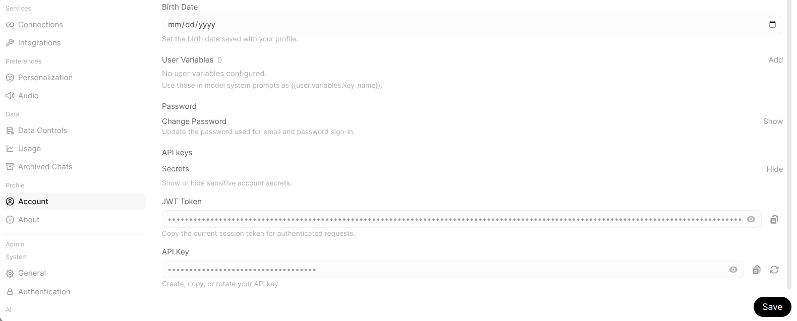

# Getting started with the API

## Prerequisites

In order to use the SciLifeLab OpenLLM service through API calls you need to be a [registered and approved user of the service](../registration/).

## Get your API key

1. Log in to [https://openllm.scilifelab.se](https://openllm.scilifelab.se)
2. Go to **Settings → Account → API Keys**
3. Click **Create new API key**
4. Copy and save the key securely. It starts with `sk-`

!!! note
    If you do not see the option to create an API key, ask the pilot team ([openllm@scilifelab.se](mailto:openllm@scilifelab.se)) to add you to the Pilot Users group.

    Your API key expires after 4 weeks. Regenerate it when it stops working.

## Make your first API call

SciLifelab OpenLLM exposes an OpenAI-compatible API. This means any script, tool, or library, that works with the OpenAI API also works with our service. You only need to change two things: the base URL (`https://openllm.scilifelab.se/api`) and the API key(`sk-...`).

We put together more detailed documentation about various ways you can use the API:

- [Using the API in scripts and workflows](../scripts/)
- [Connect to VS Code](../vscode/)
- [Connect to Claude Code](../claudecode/)
- [Connect to Qwen Code](../qwencode/)
- [Connect to Obsidian](../obsidian/)
- ... (find more pages in the documentation menu)

## Tips for getting good results

- **Be specific in your prompts.** Clear, structured instructions produce better output. Instead of "analyze this data", try "extract the drug name, dosage, and outcome from the following clinical text and return the result as JSON."
- **Use system prompts.** The system message in the `messages` array sets the model's behavior. Use it to constrain the output format and give the model a role.
- **Keep context focused.** If you are processing long documents, break them into chunks and process each separately. This produces more coherent results.
- **Set `max_tokens` appropriately.** If you only need a one-word classification, set `max_tokens=10`. This speeds up responses and reduces irrelevant output.
- **Temperature 0 for deterministic tasks.** For extraction, classification, or anything where you want reproducible results, set `"temperature": 0` in your request.

## Troubleshooting

- **"Unauthorized" or 401 error:** Your API key is invalid or expired. Regenerate it in Open WebUI (**Settings → Account → API Keys**).
- **"Model not found" error:** The model name in your request doesn't match what's available. Check `/api/models` for the exact name.
- **Slow responses:** This is a pilot on shared infrastructure, not a production service. Response times will vary depending on load. If latency matters for your workflow, try reducing `max_tokens` or breaking requests into smaller chunks.
- **Connection timeout:** The service may be temporarily down for maintenance or model changes. Try again in a few minutes. If it persists, email [openllm@scilifelab.se](mailto:openllm@scilifelab.se).

Need help getting started? Email [openllm@scilifelab.se](mailto:openllm@scilifelab.se) or reach out on Slack.