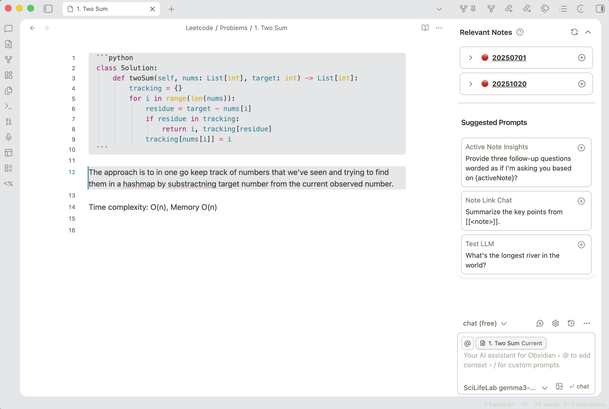
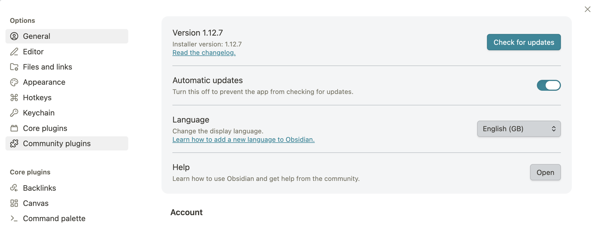
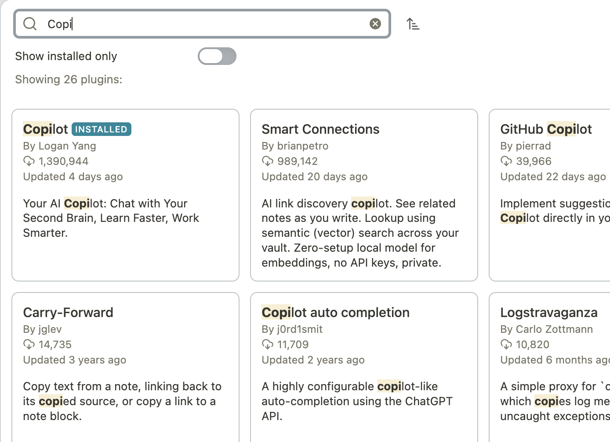
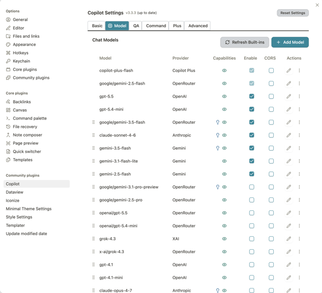
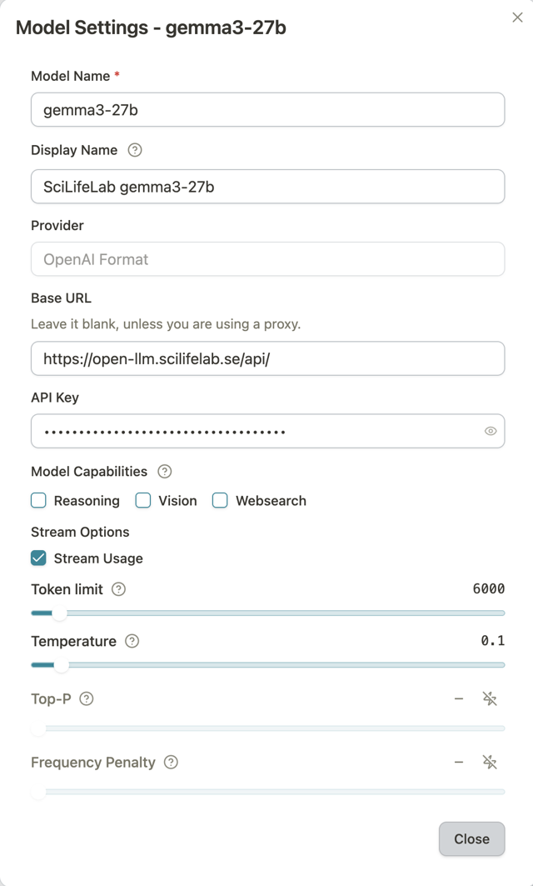
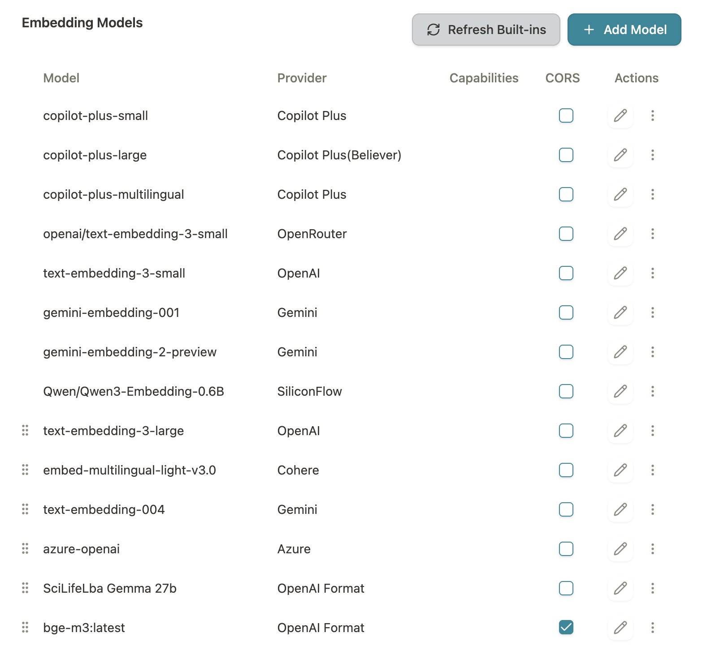

# Connect to Obsidian

Obsidian is a free Markdown note-taking app that has a wide selection of plugins. One of them allows you to use LLMs directly in the app with your notes.

You can ask questions about a note or a combination of notes, edit them using an LLM, and build an index of related notes in your knowledge base.

## Prerequisites

In order to connect SciLifeLab OpenLLM to Obsidian on your computer, you need to have [obtained an API key from your user account](../getting-started-api/). You also need Obsidian to be installed on your computer. You can follow the [official Obsidian guide to install it](https://obsidian.md/help/install).

## Configuring Obsidian

**Setup**

1. Open **Settings**.
2. Open **Community plugins**.

   

3. **Browse**.
4. Find the **Copilot** plugin and install it.

   

5. **Enable** it.
6. Open **Options**.
7. In the **Models** tab click **Add chat model**.

   

8. Fill out the form:

    - **Model name:** `qwen3`
    - **Provider:** OpenAI Format
    - **Base URL:** `https://openllm.scilifelab.se/api`
    - **API key:** `sk-*` — take it from Open WebUI
    - **Tick** CORS

   

## Index of your notes

If you want to build an index of your notes you need to add an embedding model:

    - **Model name:** `bge-m3:latest`
    - **Provider:** OpenAI Format
    - **Base URL:** `https://openllm.scilifelab.se/api`
    - **API key:** `sk-*` — take it from Open WebUI
    - **Tick** CORS

   

You can read more about the plugin in the official user guide *Documentation*.
