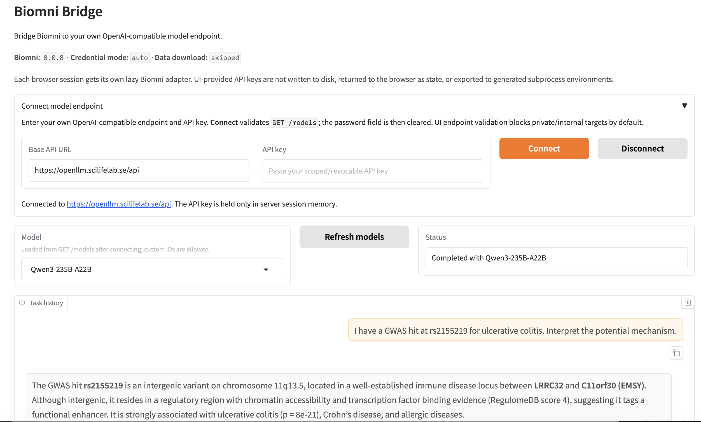
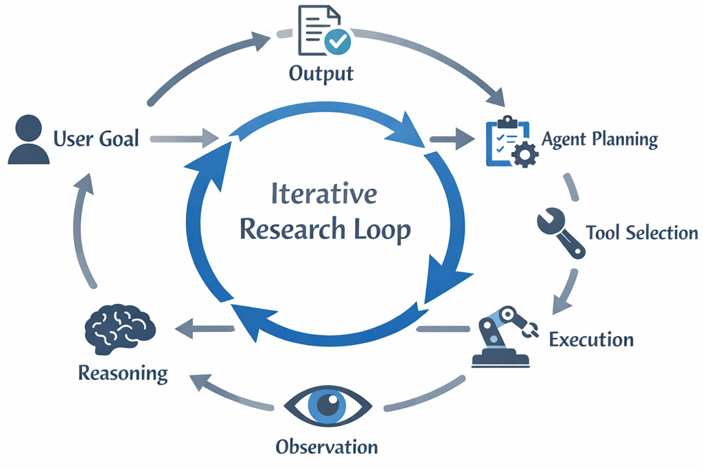

# Connect to scientific tools

## Prerequisites

In order to connect these tools to SciLifeLab OpenLLM you need to have [obtained an API key from your user account](../getting-started-api/).

## ToolUniverse

[ToolUniverse](https://github.com/mims-harvard/ToolUniverse) is an open-source package that gives scripts and LLM workflows access to scientific tools and databases such as PubMed, UniProt, ChEMBL, ClinicalTrials.gov, and AlphaFold.

### Install

In a Python environment:

```bash
pip install tooluniverse
```

Try a database tool first. This does not use an LLM:

```bash
tu run PubMed_search_articles '{"query":"CRISPR","max_results":1}'
```

Result:

```bash
{
  "status": "success",
  "data": [
    {
      "pmid": "42643272",
      "title": "Physical activity stimulates neurogenesis via sensory neuron activity in postembryonic zebrafish.",
      "authors": [
        "Sherlock S",
        "Appel L",
        "Hall Z",
        "Phan A"
      ],
      "author_count": 4,
      "authors_truncated": false,
      "journal": "iScience",
      "pub_date": "2026 Sep 18",
      "pub_year": "2026",
      "doi": "10.1016/j.isci.2026.117207",
      "pmcid": "PMC13503103",
      "article_type": "Journal Article",
      "url": "https://pubmed.ncbi.nlm.nih.gov/42643272/",
      "doi_url": "https://doi.org/10.1016/j.isci.2026.117207",
      "pmc_url": "https://www.ncbi.nlm.nih.gov/pmc/articles/PMC13503103/"
    }
  ],
  "metadata": {
    "count": 1,
    "total": 70279,
    "query": "CRISPR",
    "source": "PubMed"
  }
}
```

### Connect to SciLifeLab OpenLLM

Use the API key you created earlier in this guide. Replace `<MODEL_NAME>` with a chat model returned by `/api/models`.

```bash
export OPENAI_API_KEY="<change-it-to-sk-your-api-key>"
export OPENAI_BASE_URL="https://openllm.scilifelab.se/api"
export TOOLUNIVERSE_LLM_CONFIG_MODE="env_override"
export TOOLUNIVERSE_LLM_DEFAULT_PROVIDER="OPENAI"
export TOOLUNIVERSE_LLM_MODEL_DEFAULT="<MODEL_NAME>"
export AGENTIC_TOOL_FALLBACK_CHAIN='[]'
```

The last line prevents ToolUniverse from falling back to external LLM providers if the SciLifeLab endpoint is unavailable.

Test an LLM-powered ToolUniverse tool:

```bash
tu run ScientificTextSummarizer '{"text":"Metformin lowers hepatic glucose output.","summary_length":"20","focus_area":"mechanism"}'
```

Result:

```bash
{
  "success": true,
  "result": "Metformin reduces liver glucose production by activating AMPK, inhibiting gluconeogenesis, and improving insulin sensitivity.",
  "metadata": {
    "prompt_used": "You are a biomedical expert. Please summarize the following biomedical text in 20 words, focusing on mechanism:\n\nMetformin lowers hepatic glucose output.\n\nProvide a clear, concise summary that captures the most important information.",
    "input_arguments": {
      "text": "Metformin lowers hepatic glucose output.",
      "summary_length": "20",
      "focus_area": "mechanism"
    },
    "model_info": {
      "api_type": "OPENAI",
      "model_id": "Qwen3-235B-A22B",
      "temperature": 0.2
    },
    "execution_time_seconds": 2.540479,
    "timestamp": "2026-08-26T14:31:46.316332"
  }
}
```

### Simple use cases

- Search PubMed or other scientific databases from a script, then summarize or screen the results.
- Combine information from tools such as UniProt, ChEMBL, or ClinicalTrials.gov in a research workflow.

For more examples, see the [ToolUniverse documentation](https://zitniklab.hms.harvard.edu/ToolUniverse/) and the [example research workflows in the ToolUniverse repository](https://github.com/mims-harvard/ToolUniverse/tree/main/skills).

## Biomni Bridge



[Biomni Bridge](https://pypi.org/project/biomni-bridge/) lets you connect Biomni to the OpenLLM API through a simple Gradio interface and a reproducible Docker environment.

It simplifies the setup and makes Biomni easier to get started with. For full details, see the [Biomni Bridge documentation](https://github.com/anondo1969/biomni-bridge/blob/main/README.md).

For a quick start, follow one of the options below.

### Install from PyPI

Biomni Bridge requires **Python 3.11**.

Create and activate a virtual environment:

```bash
python3.11 -m venv .venv
source .venv/bin/activate

python -m pip install --upgrade pip
python -m pip install biomni-bridge
```

For a basic setup, no environment variables are required. Start Biomni Bridge with:

```bash
biomni-bridge
```

Then open:

```text
http://127.0.0.1:7860
```

Enter the **OpenLLM base URL** and **API key** in the UI, then connect and select a model.

### Quick start with Docker

Create local directories for data and output:

```bash
mkdir -p data output
```

Run the published image:

```bash
docker run --rm \
  --security-opt=no-new-privileges:true \
  --cap-drop=ALL \
  -p 127.0.0.1:7860:7860 \
  -v "$(pwd)/data:/data" \
  -v "$(pwd)/output:/output" \
  ghcr.io/anondo1969/biomni-bridge:latest
```

Then open:

```text
http://127.0.0.1:7860
```

Enter the **OpenLLM base URL** and **API key**, click **Connect**, choose a model, and run a task.

### Biomni Data Lake

To use the Biomni Data Lake, see the [Data Lake documentation](https://github.com/anondo1969/biomni-bridge/blob/main/README.md#biomni-data).



These are practical starting points, not exhaustive. The common thread is that an LLM accessed via API can handle repetitive tasks that would otherwise take hours of manual work. None of these require building a full application. A short Python script calling the API is often enough.

- **Literature triage and screening.** Feed a batch of abstracts to the API and ask it to classify each by relevance to your research question, extract key methods, or flag papers that mention a specific gene, compound, or technique. Useful when screening hundreds of PubMed search results for a systematic review.
- **Structured data extraction from unstructured text.** Clinical notes, lab reports, supplementary materials, and protocol documents all contain structured information buried in free text. The API can extract drug names, dosages, cell lines, organism names, or experimental conditions into JSON or CSV format for downstream analysis.
- **Drug and gene annotation assistance.** Given a list of gene names or compound identifiers, the API can generate draft functional annotations, summarize known interactions, or classify genes by pathway involvement. For example, loop through a list of differentially expressed genes and ask the model to summarize each gene's known role and disease associations. The output is a starting point for curation, not a replacement for database lookup.
- **Protocol and methods drafting.** Given a set of parameters (organism, assay type, reagents, equipment), the API can draft a first version of a methods section or standard operating procedure. The output still needs expert review, but it saves time on the boilerplate.
- **Translation and reformatting across formats.** Convert code between languages (R to Python), reformat data descriptions for repository submissions (e.g. GEO, ArrayExpress metadata), or translate abstracts for multilingual dissemination.

These examples are the simplest form of LLM integration: one script, one API call per item, no tool use. For more advanced use cases where the LLM calls external tools (PubMed, UniProt, ChEMBL), orchestrates multi-step reasoning, or acts autonomously — what the field calls AI agents; see the [Integration in agentic systems](../agents/) page for more on that.