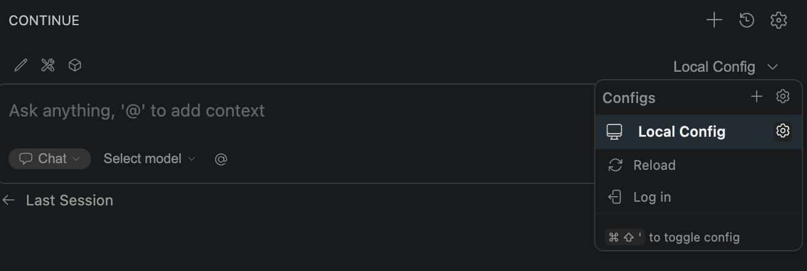

# Connect to VS Code (Continue extension)

## Prerequisites

In order to connect SciLifeLab OpenLLM to Visual Studio Code you need to have [obtained an API key from your user account](../getting-started-api/).

## Connect to VS Code

Based on this guide: [Connect Visual Studio Code to Open WebUI for vibe coding](https://henrynavarro.org/connect-vs-code-to-open-webui-for-vibe-coding-e6f74f1148ec)

Continue is an open-source AI code assistant extension for VS Code. To connect it to our service:

1. Install the Continue extension from the VS Code marketplace.
2. Open Continue config.



3. Update the config file:

```yaml
name: Local Assistant
version: 1.0.0
schema: v1
models:
  - name: qwen3
    provider: openai
    model: qwen3
    apiBase: https://openllm.scilifelab.se/api
    apiKey: sk-YOUR-TOKEN
    template: none
    defaultCompletionOptions:
      contextLength: 128000
      maxTokens: 8192
    roles:
      - chat
      - edit
      - apply
      - autocomplete
# More models could be added this way
context:
  - provider: code
  - provider: docs
  - provider: diff
  - provider: terminal
  - provider: problems
  - provider: folder
  - provider: codebase
```